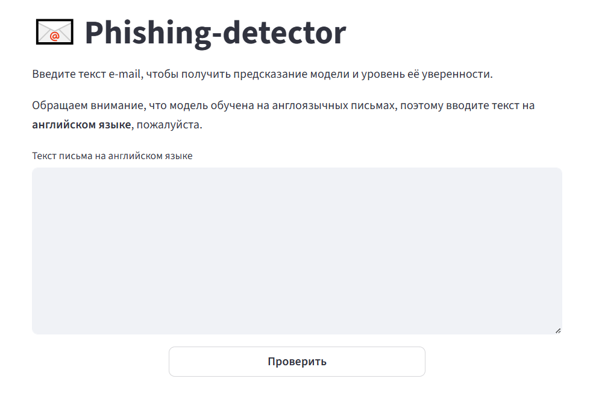

# 📧 Phishing Detector
Приложение для определения фишинговых писем с помощью модели DistilBERT.
Проект включает FastAPI, Streamlit-интерфейс, Docker и тесты с Pytest.

## Возможности
* Анализ текста письма на английском языке
* Предобработка текста
* Модель DistilBERT
* Уровень уверенности модели
* Streamlit-интерфейс для визуального ввода
* API на FastAPI
* Docker и docker-compose для запуска



## Стек технологий
* Python 3.10
* Transformers (DistilBERT)
* TensorFlow
* NLTK
* FastAPI
* Streamlit
* Docker
* Pytest
* GitHub Actions

## Обучение модели
Процесс обучения DistilBERT (а также LSTM и Logistic regression) представлен в папке **/model_training**

## Запуск проекта c Docker
```
docker-compose up --build
```
FastAPI: http://localhost:8000/docs

Streamlit: http://localhost:8501

## Запуск без Docker
```
pip install -r requirements.txt

uvicorn api.api:app --reload

streamlit run ui/app.py
```

## Недостающие данные

Из-за ограничений GitHub файлы больше 100 MB не хранятся в репозитории, поэтому веса модели и данные для обучения модели можно скачать по ссылке:<br> (https://drive.google.com/drive/folders/1S2ZFXDzgETbiSd4hkN5piQDqhBQejcof?usp=sharing)

После скачивания разместите файлы в следующих папках проекта:
* model_training/phishing_email_full.csv 
* model/tf_model.h5

