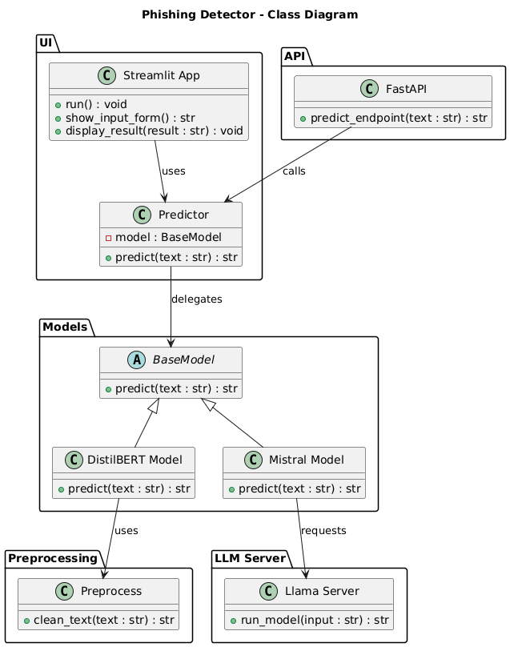

# 📧 Phishing Detector
Проект для классификации e-mail с использованием двух моделей:
- **DistilBERT** — быстрая классификация английских писем
- **Mistral (через llama.cpp)** — классификация с объяснением писем на любом языке

Проект включает FastAPI, Streamlit-интерфейс, Docker и тесты с Pytest.

## Возможности
- Веб‑интерфейс на Streamlit
- REST API на FastAPI
- Поддержка двух моделей:
  - DistilBERT (через HuggingFace Transformers)
  - Mistral 7B Instruct (через llama.cpp сервер)
- Предобработка текста для DistilBERT
- Возможность выбора модели для предсказания


## Стек технологий
- Python 3.10
- Transformers (HuggingFace) — DistilBERT
- llama.cpp — Mistral 7B Instruct
- NLTK
- FastAPI
- Streamlit
- Docker
- Pytest
- GitHub Actions

 

## Обучение модели
Процесс обучения DistilBERT (а также LSTM и Logistic regression) представлен в папке **/model_training**

## Запуск проекта c Docker
```
docker-compose up --build
```
UI будет доступен по адресу: http://localhost:8501

## Недостающие данные

Из-за ограничений GitHub файлы больше 100 MB не хранятся в репозитории, поэтому веса моделей и данные для обучения DistilBERT можно скачать по ссылке:<br> (https://drive.google.com/drive/folders/1S2ZFXDzgETbiSd4hkN5piQDqhBQejcof?usp=sharing)

После скачивания разместите файлы в следующих папках проекта:
* model_training/phishing_email_full.csv 
* models/mistral-7b-instruct-v0.1.Q5_K_M.gguf
* models/pytorch_model.bin

